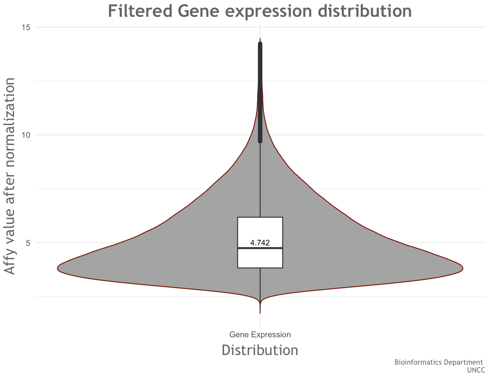

Gene expression data processing
================

Affy data analysis
------------------

### Global distribution of affy data

After normalization and filter

    ##         MIN      p25   MEDIAN      p75     MAX
    ## 1: 1.945978 3.822496 4.741859 6.175965 14.2413

#### Violin Box Plot

### Distribution by Probe names

    ##          probe_name      MIN      p25   MEDIAN      p75      MAX
    ##     1:      1053_at 3.685963 4.707804 5.098259 5.568051 7.062105
    ##     2:       121_at 4.483351 5.339636 5.570102 5.851750 7.174859
    ##     3:    1405_i_at 2.364553 2.838324 3.332836 4.275592 7.448380
    ##     4: 1552256_a_at 4.160301 5.666648 5.981411 6.561211 8.767597
    ##     5: 1552257_a_at 2.990207 3.492547 3.858015 4.215931 5.645804
    ##    ---                                                          
    ## 21144:     91682_at 3.532035 4.162023 4.385711 4.770149 9.865487
    ## 21145:   91684_g_at 4.333923 4.653791 4.833993 5.168284 9.114246
    ## 21146:     91703_at 3.449333 4.454473 5.011418 5.512229 6.842030
    ## 21147:     91920_at 4.880074 5.447148 5.620825 5.877206 7.076265
    ## 21148:     91952_at 3.861915 4.676413 4.919038 5.182135 6.250254
